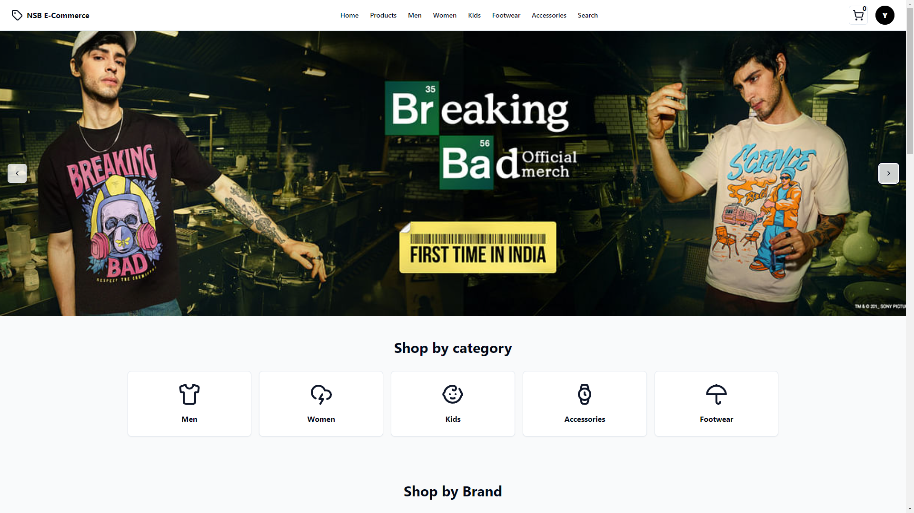
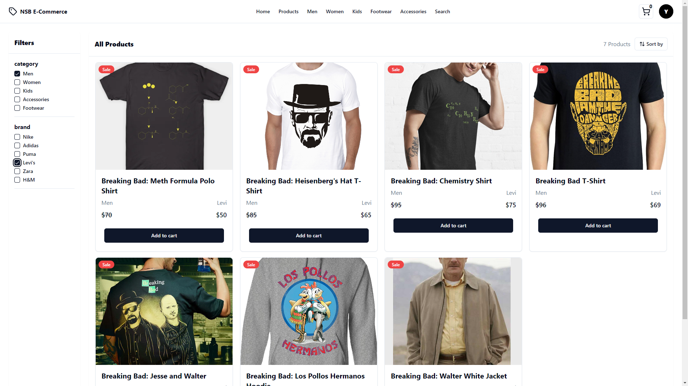
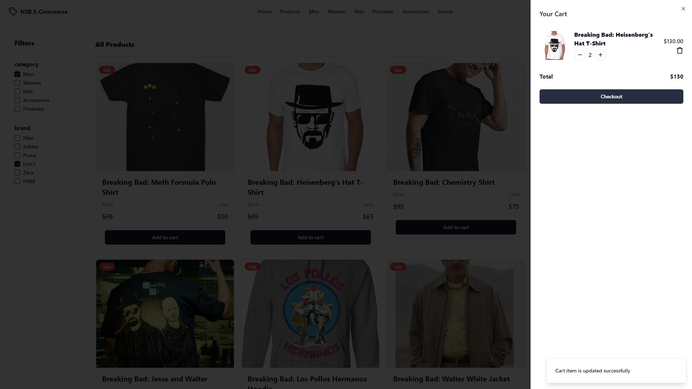
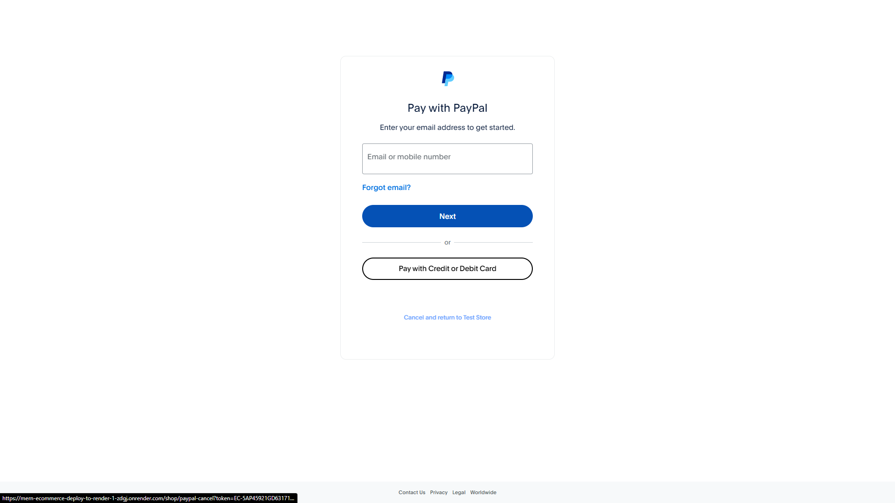
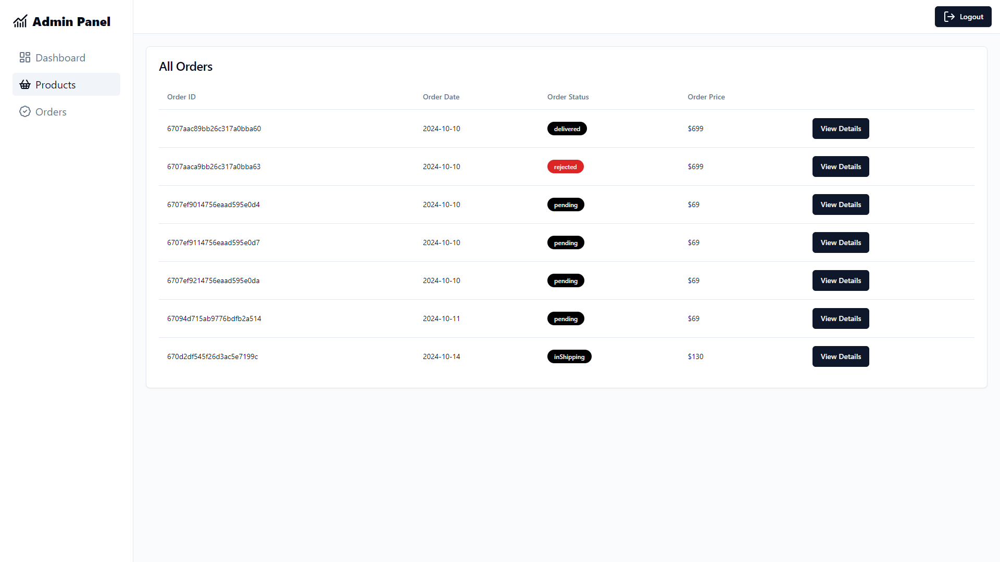

# NSB E-Commerce

Welcome to the NSB E-Commerce Application! This is a full-stack eCommerce web application built using the MERN stack (MongoDB, Express, Vite + React, Node.js). The application features user authentication, product management, cart functionality, and PayPal payment integration.

## Live Demo

Check out the live application here:  
[Live Demo](https://mern-ecommerce-deploy-to-render-1-zdgj.onrender.com/)

## Features

- **User Authentication**: Sign up, login, and manage user profiles.
- **Product Listings**: Browse all available products with detailed information.
- **Cart Management**: Add products to the cart and manage the checkout process.
- **Payment Integration**: Secure payments using PayPal.
- **Admin Dashboard**: Admin users can manage products, users, and orders.

## Tech Stack

- **Frontend**: Vite, React, Redux, Tailwind CSS
- **Backend**: Node.js, Express
- **Database**: MongoDB
- **Authentication**: JWT (JSON Web Tokens)
- **Payment Integration**: PayPal
- **Deployment**: Render

## Screenshots

### Home Page

### Product Listing

### Cart Page

### Checkout Page

### Admin Dashboard

# Start the server
npm run server

# Start the client (using Vite)
cd client
npm run dev

The application will run locally at http://localhost:3000

## Contributing
Feel free to contribute by submitting pull requests. For significant changes, please open an issue to discuss your ideas first.

## License
This project is licensed under the MIT License. 